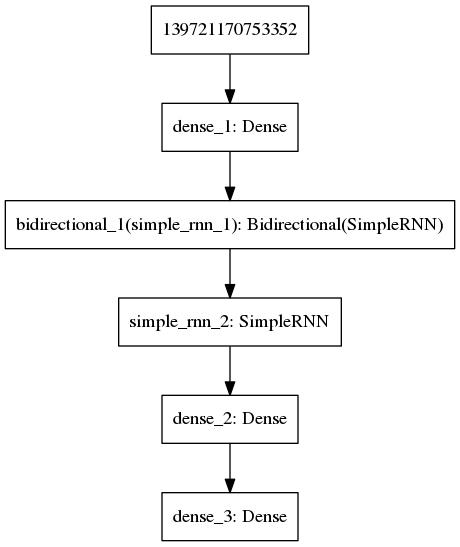

Тестовые задания в "Лабораторию Касперского"
============================================

Оглавление:

- [Реализация игры "Жизнь"](#Реализация-игры-Жизнь).
- [Нейронная сеть, предсказывающая ход](#Нейронная-сеть-предсказывающая-ход).


Реализация игры "Жизнь"
-----------------------


### Описание

Необходимо, используя подход ООП, разработать интерфейс и реализацию класса, который будет представлять собой состояние игрового поля и контролировать его изменение в соответствии с правилами.
Следует считать, что края игрового поля циклически замкнуты.
[Оригинальное описание в PDF](test_problem_C++.pdf).

**Сейчас реализованы только ходы вперёд и проверка на завершение только по счётчику живых клеток и по количеству изменений на шаге**.


#### Начальные условия игры

- Предполагается, что пользователь имеет замкнутое поле заданного размера.
- На заданном пространстве распределены клетки так, как это задано пользователем.


#### Требования

Исходя из задачи и возможного развития проекта, были выдвинуты следующие требования к движку:

- Пользователь может задавать размер поля.
- Пользователь может задавать распределение на поле.
- Пользователь может контролировать ходы игры, т.е. иметь возможность сделать ход вперёд и ход назад.


### Интерфейс класса

Исходя из требований, класс должен:

- Иметь конструкторы, принимающие распределение в том или ином виде.
- Иметь функции, позволяющие сделать шаги в одном из направлений.
- Быть способен визуализировать поле.


#### Конструкторы

Возможны два конструктора:

- Конструктор, которому передаётся, сформированное пользователем поле.
- Конструктор, которому передаются размеры поля и функция распределения.

Из них я использую только второй, чтобы не привязываться к формату хранения поля.


#### Функция распределения

Считаю, что поле двумерно, потому предполагается, что функции распределения будут передаваться координаты и ссылка на текущий объект класса.
Текущий элемент будет установлен в то значение, которое вернёт функция распределения.


#### Метод хода

- Шаг может передаваться числовым параметром, либо может иметься два метода, позволяющие делать шаги вперёд и назад.
- В качестве интерфейса для реализации хода выбран один метод с целочисленным параметром, как более универсальный.
- Метод возвращает true, если ещё возможны ходы, либо false, если игра завершена.


#### Получение состояния поля

Поле должно быть возвращено обработчику, либо в виде ссылки, либо в виде возможности его обхода через Visitor.

- Был проведён опрос потенциальных пользователей библиотеки (в виде одного разработчика),
  100% пользователей выразили желание работать со ссылкой на поле, а не с Visitor.
- Плюсом же паттерна Visitor будет изоляция метода обработки данных, от структуры хранилища игрового поля.
- Существует компромиссный вариант: считать, что поле всегда двумерно и иметь метод для получения ячейки по заданным координатам.

Было принято решение использовать вариант с методом, возвращающим ячейку по координатам и вариант с Visitor.


### Реализация класса

На текущий момент, для каждой клетки достаточно флага, указывающего чёрная она или белая.
Хранить дополнительные данные не требуется.
Потому, для хранения поля выбран std::vector<bool>.
Преобразование из двумерных координат в одномерные производится "на лету".
Существует внутренний метод, который реализует логику хода.


#### Правила игры

Ход игры:

- В пустой (мёртвой) клетке, рядом с которой ровно три живые клетки, зарождается жизнь.
- Если у живой клетки есть две или три живые соседки, то эта клетка продолжает жить.
- Если соседей у клетки меньше двух или больше трёх, клетка умирает.

Условия завершения игры:

- На поле не останется ни одной живой клетки.
- Конфигурация на очередном шаге в точности (без сдвигов и поворотов) повторит себя же на одном из более ранних шагов
  (складывается периодическая конфигурация).
- При очередном шаге ни одна из клеток не меняет своего состояния (складывается стабильная конфигурация; предыдущее правило, вырожденное до одного шага назад).


#### Алгоритм работы

Простейший вариант - формировать второй массив, содержащий поле, но он требует двойного расхода памяти.
Чтобы этого избежать, я буду использовать модифицированный алгоритм:

- Состояние клетки зависит только от числа соседей.
- Получаю количество соседей.
- Если клетка меняет своё состояние, заношу её индекс в список изменений.
- Когда все клетки пройдены, применяю список изменений к полю.


### Сборка

Для сборки требуется CMake версии не ниже 3.1 и компилятор, поддерживающий C++14.
Сборка проверялась на gcc. Реализация проверялась на Debian Linux 9.

```
$ cmake . && make
$ ./life 40 30
```


Нейронная сеть, предсказывающая ход
-----------------------------------

### Постановка условия

[По условию задачи](python_life/Task.txt) необходимо создать нейронную сеть, которая сможет предсказывать следующий шаг в игре "Жизнь".
[Данный в задаче генератор](python_life/gol_dataset.py) создаёт массив состояний, в котором каждому случайно сгенерированному состоянию, соответствует состояние, сгенерированное по правилам игры.

Фактически, сеть должна вывести правила игры.
Если знать, что состояние клетки определяется её окрестностью Мура порядка 1, возможно разбить поле на квадраты 3x3 и обучить классификатор на данных квадратах.
В таком случае, задача сводится к задаче классификации при фиксированном числе классов (2^9).

Тем не менее, предполагается, что я этого не знаю. И задача сводится к более общей: "На основе вектора состояния и примеров переходов между векторами, породить следующий вектор состояния".
При этом, "вектор состояния" описывается матрицей поля. И задача является задачей прогнозирования.


### Выбор алгоритма работы и архитектуры сети



Предварительно были исследованы сети прямого распространения.
Сеть подобной конфигурации в Keras на 20 циклах обучения и выборке из 9000 "полей" даёт точность порядка 0.73:

```python
model = Sequential()

model.add(Dense(height, input_shape=(width, height), activation='relu'))
model.add(Dense(width * height, init='uniform', activation='relu'))
model.add(Dense(height, init='uniform', activation='sigmoid'))
model.summary()
model.compile(loss='binary_crossentropy',
              optimizer='adam',
              metrics=['accuracy'])
...

model.fit(x_train, y_train, epochs=20, verbose=1, validation_split=0.1)
```

Проблема в том, что это не 0.75 верно предсказанных результатов, а 0.73 поверхности поля.
Максимум, которого удалось достичь - 0.8 при следующей конфигурации сети:

```python
model.add(Dense(height, input_shape=(width, height), activation='selu'))
model.add(Dense(width * height, init='uniform', activation='relu'))
model.add(Dense(width * height * 10, init='uniform', activation='relu'))
model.add(Dense(height, init='uniform', activation='sigmoid'))
```

Этого явно недостаточно для уверенного предсказания хода на поле размерностью 20x30.

С задачей прогнозирования лучше всего справляются сети с памятью, т.е. рекуррентные.
Если бы переходы из состояния в состояние представляли собой серии событий, то рекуррентные модули, сохраняющие состояние в течение длительного периода, подошли бы лучше всего.
Например, [LSTM](https://en.wikipedia.org/wiki/Long_short-term_memory) или [GRU](https://en.wikipedia.org/wiki/Gated_recurrent_unit) блоки.

Проблема заключается в том, что генератор создаёт не связанные между собой состояния, а лишь набор независимых переходов: предыдущее состояние - следующее состояние.
Т.е., предыдущее состояние не учитывается.
Если использовать такой рекуррентный модуль, он будет считать, что все сэмплы связаны и запоминать переходы, которые таковыми не являются и не соответствуют правилам.

Один из вариантов - предварительная группировка состояний с целью поиска последовательностей переходов и дальнейшее использование RNN.

Тем не менее, не хочется делать предобработку, основываясь на дополнительном знании о данных (например, о распределении ГСЧ).
Таких последовательностей может не быть. И при возрастании размерности поля, вероятность их обнаружить уменьшается нелинейно.

Однако, Keras содержит [SimpleRNN блок](https://keras.io/layers/recurrent/#simplernn), "проблемой" которого является то, что он забывает ранние состояния.
С данным блоком удалось достигнуть максимальной точности прогноза более 0.97, при использовании враппера [Bidirectional](https://keras.io/layers/wrappers/#bidirectional).


### Реализация

Параметры поля не указываются, а берутся из переданного HDF файла.
В качестве библиотеки для построения нейросети был использован Keras. Топология сети, функции и коэффициенты подобраны, в основном, экспериментально.
Для более стабильного обучения был добавлен слой нормализации.
Для того, чтобы не дублировать код, генератор был переделан, потому из него производится импорт функции для генерации тестовых данных.


### Запуск

Код находится в каталоге [`python_life`](python_life).
Должен быть доступен интерпретатор Python3, а также установлены пакеты:

- [Keras](https://keras.io/) и какой-либо бэкэнд (я использовал TensorFlow) - используется для построения сети.
- [H5py](https://www.h5py.org/) - для работы с файлами в формате HDF5.
- [Tqdm](https://github.com/tqdm/tqdm) - прогресс-бар.

После этого надо сгененрировать файл с данными и запустить сеть:

```
$ ./gol_dataset.py
$ ./neuro_life.py dataset_20x30x10000.h5
```

После прохождения обучения сетью, она выполнит предсказания на случайно сгенерированных данных.
Будет выведен результат, указывающий то, насколько точно, в среднем, сеть предсказывает ход:

```
Using TensorFlow backend.
Test task implementation
Reading "dataset_20x30x10000.h5"...
_________________________________________________________________
Layer (type)                 Output Shape              Param #   
=================================================================
dense_1 (Dense)              (None, 20, 600)           18600     
_________________________________________________________________
bidirectional_1 (Bidirection (None, 20, 600)           1441200   
_________________________________________________________________
simple_rnn_2 (SimpleRNN)     (None, 20, 600)           720600    
_________________________________________________________________
dense_2 (Dense)              (None, 20, 600)           360600    
_________________________________________________________________
batch_normalization_1 (Batch (None, 20, 600)           2400      
_________________________________________________________________
dense_3 (Dense)              (None, 20, 30)            18030     
=================================================================
Total params: 2,561,430
Trainable params: 2,560,230
Non-trainable params: 1,200
_________________________________________________________________
Train on 9500 samples, validate on 500 samples
Epoch 1/15
2018-09-20 15:41:12.228638: I tensorflow/core/platform/cpu_feature_guard.cc:141] Your CPU supports instructions that this TensorFlow binary was not compiled to use: AVX2 FMA
9500/9500 [==============================] - 96s 10ms/step - loss: 0.4233 - acc: 0.7863 - val_loss: 0.3662 - val_acc: 0.8234
Epoch 2/15
9500/9500 [==============================] - 99s 10ms/step - loss: 0.2513 - acc: 0.8967 - val_loss: 0.2704 - val_acc: 0.8765
Epoch 3/15
9500/9500 [==============================] - 93s 10ms/step - loss: 0.1574 - acc: 0.9454 - val_loss: 0.1883 - val_acc: 0.9264
...
9500/9500 [==============================] - 102s 11ms/step - loss: 0.0804 - acc: 0.9700 - val_loss: 0.1089 - val_acc: 0.9595
Epoch 15/15
9500/9500 [==============================] - 104s 11ms/step - loss: 0.0735 - acc: 0.9723 - val_loss: 0.1104 - val_acc: 0.9581
Generate x_train
100%|███████████████████████████████████████████████████████████████████████████████████████████████████████████████████████████████████████████████████| 10000/10000 [00:00<00:00, 64739.40it/s]
Generate y_train
100%|████████████████████████████████████████████████████████████████████████████████████████████████████████████████████████████████████████████████████| 10000/10000 [00:01<00:00, 5643.04it/s]
Prediction started...
Predictions testing started...
100%|███████████████████████████████████████████████████████████████████████████████████████████████████████████████████████████████████████████████████| 10000/10000 [00:00<00:00, 13979.49it/s]
Step correct prediction rate = 0.9583171666666481
Correct predicted steps = 0
```


### Результаты

Сеть учится и предсказывает ход с достаточно высокой точностью. Хотя, этого и не вполне достаточно для полностью корректного предсказания хода на поле 20x30.
Скорость обучения составляет порядка 1.5 минуты на итерацию на Core-i7 с 8 ядрами, без использования AVX и FMA расширений.
При обучении за 20 эпох, была достигнута максимальная точность предсказания хода порядка 0.97.
Т.е., на ход сейчас приходится около 3% ошибок.

